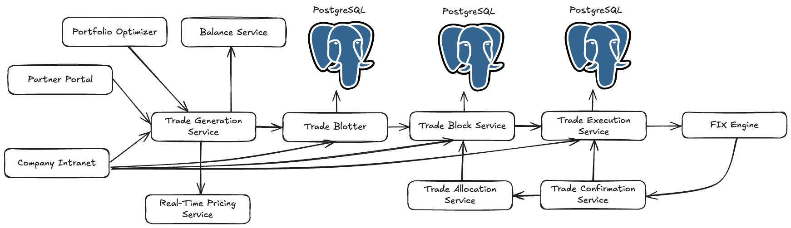
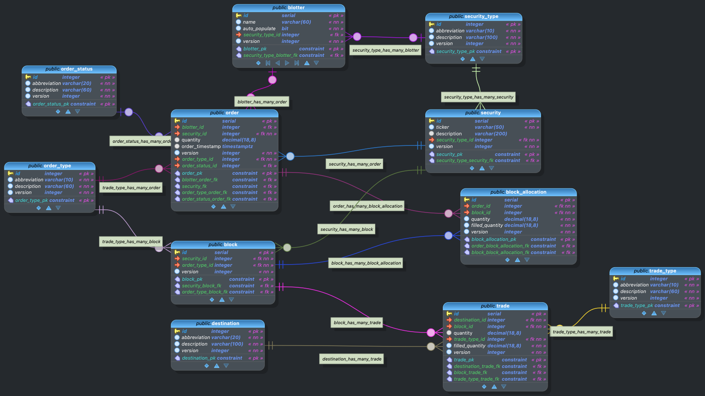

# Requirements for the Blotter Microservice

## Context Diagram

## Data Model

## General Requirements

We are developing a suite of applications called the GlobeCo Suite.  The GlobeCo Suite is being built as part of a Kubernetes Autoscaling Benchmark called KASBench.  The suite consists primarily of microservices written in Java, Go, and 
Python.

You are an elite software developer assisting on this project.  You are an expert at Kubernetes, Java, Spring Boot, Python, and Go.  You will always follow these instructions.

The following context applies to all microservices regardless of programming language:

* Microservices will be deployed on Kubernetes version 1.32
* Microservice should be easy to follow and transparent.  Prefer simplicity over efficiency.  It is important that researchers are able to read and understand the code.  Prioritize readability over elegance.
* These microservices are being developed to benchmark Kubernetes autoscalers.  They will never be production applications.  We want to make it as easy as possible to interpret the results of actions taken by autoscalers with as little interference as possible.  Therefore, microservices should avoid resiliency features such as circuit breakers, back pressure, rate limiting, load shedding, and retry logic.
* These microservices do not need to be secure.  There is no need for passwords or other security features.  We are trying to avoid anything that might interfere with the goal of benchmarking autoscalers. These microservices will never have real data or access to anything of significance.
* Microservices should not require encryption or anything that might result in export restrictions.
* Microservices should implement Kubernetes health checks, including readiness, liveness, and startup probes.
* Whenever required, use "Noah Krieger" as the author's name and noah@kasbench.org as the email address.
* The license for all microservices should be Apache V2.0.
* Take as much time as necessary to reflect on the problem and check your work.
* Provide complete and executable code solutions.
* Follow the normative practices for the programming language and frameworks being used.
* Assure interoperability between components that are meant to work together.
* Include logging following industry best practices.
* Follow best practices for REST APIs.
* All database tables have a `version` column defined as an integer.  Version columns are used for optimistic concurrency.  When generating ORM entities, identify these columns so that optimistic concurrency control is applied. 
* Before taking any action, review cursor-log.md to see what you have previously done.
* The project has been started using Spring Initializr.  
* The project uses Gradle for build automation.  Please review the build.gradle file in the project root to learn the Java version, Spring Boot version, and dependencies.  All the version numbers in the build.gradle file are valid.  The specified versions exist, even if you don't know about them yet.

This is very important:
* Log all prompts you receive in the file cursor-prompts.md in the project root.  Please do this for every prompt.
* Log all actions you take in the file cursor-log.md in the project root.  Please do this every time you take an action.

## Business Requirements

* The Trade Blotter microservice collects trade orders and provides the functions to allow traders to _work_ trades.  Specifically, traders can decide how much of each order to place, combine trades from multiple orders into a combined _block_, and send orders to the Trade Execution Service.  These actions are available to traders on the company's Intranet.  Orders and trades are stored in a PostgreSQL database.

The name of the Kubernetes microservice is `globeco-trade-blotter`.  The microservice will be written in Java 21 and Spring Boot.

The service consists of the following resources

### Security Type

Security type refers to the classification of a financial instrument based on its nature and how it represents ownership or debt.  Examples include common stock, preferred stock, corporate bond, treasury note, and call option.

The name of the resource is `securityType`

 Botters have the following fields:

| Database Name | API Name | API Datatype |  Description | Constraints |
| --- | --- | --- | --- | --- |
| id | securityTypeId | Integer | Immutable resource identifier. | Required |
| abbreviation | abbreviation | String | Abbreviation for the security type. | Required.  The maximum length is 20 characters. |
| description | description | String | Long description of the security type for display.| Required.  The maximum length is 100 characters. |
| version | versionId | Integer | Version field for concurrency management. | Required |

Supports the following operations

| Resource | Verbs | Description |
| --- | --- | --- |
| /securityType/ | GET | Retrieves all security types.  Include all fields above.  | 
| /securityType/ | POST | Add a new security type.  Payload includes all fields above. |
| /securityType/{securityTypeId} | GET | Retrieves the specified securityTypeId.  Include all fields above.|
| /securityType/{securityTypeId} | PUT, PATCH | Updates the specified security type.  Payload includes the securityTypeId and all fields required for a PUT or PATCH |
| /securityType/{securityTypeId} | DELETE | Deletes the securityTypeId record.  versionId must be passed as a query parameter. |

Use standard HTTP/REST return codes.

#### Sample Data for Security Type

| id | abbreviation | description | version |
| --- | --- | --- | --- |
| 1 | CS | Common Stock | 1 |
| 2 | PS | Preferred Stock | 1 |
| 3 | CB | Corporate Bond | 1 |
| 4 | MB | Muncipal Bond | 1 |
| 5 | TBond | Treasury Bond | 1 |
| 6 | TBill | Treasury Bill | 1 |
| 7 | TNote | Treasury Note | 1 |
| 8 | CALL | Call Option | 1 |
| 9 | PUT | Put Option | 1 |
| 10 | DA | Digital Asset | 1 |
| 11 | MF | Mutual Fund | 1 |
| 12 | ETF | Exchange Traded Fund | 1 |
| 13 | CUR | Currency | 1 |
| 14 | CP | Commercial Paper | 1 |

### Blotter

Botters are used to organize orders that are being worked by the trading desk. 

The name of the resource is `blotter`

 Botters have the following fields:

| Database Name | API Name | API Datatype |  Description | Constraints |
| --- | --- | --- | --- | --- |
| id | blotterId | Integer | Immutable resource identifier. | Required |
| name | name | String | Display name of the blotter. | Required.  The maximum length is 60 characters. |
| auto_populate | autoPopulate | Boolean | If true, any order with a security having a securityTypeId that matches the securityTypeId on this record, will automatically be moved to this blotter.| Not required.  Default to false. |
| security_type_id | securityTypeId | Integer | Used with autoPopulate to automatically populate blotters for orders with a matching securityTypeId. | Not required.|
| version | versionId | Integer | Version field for concurrency management. | Required |

Supports the following operations

| Resource | Verbs | Description |
| --- | --- | --- |
| /blotter/ | GET | Retrieves all blotters.  Include all fields above.  | 
| /blotter/ | POST | Add a new blotter.  Payload includes all fields above. |
| /blotter/{blotterId} | GET | Retrieves the specified blotterId.  Include all fields above.|
| /blotter/{blotterId} | PUT, PATCH | Updates the specified blotterId.  Payload includes the blotterId and all fields required for a PUT or PATCH |
| /blotter/{blotterId} | DELETE | Deletes the blotter.  versionId must be passed as a query parameter |

Use standard HTTP/REST return codes.

#### Sample Data for Blotter

| id | name | auto_populate | security_type_id |  version |
| --- | --- | --- | --- | --- |
| 1 | Default | 0::bit | null | 1 |
| 2 | Common Stock | 1::bit | 1 | 1 |
| 3 | Priority | 0::bit | null | 1 |
| 4 | Crypto | 1::bit | 

### Trade Type

A trade type is a categorization for the way a trade may be placed with the sell side.  Values include buy, sell, sell to open, buy to close, etc. 

The name of the resource is `tradeType`.  The data is in table `trade_type`.

 Botters have the following fields:

| Database Name | API Name | API Datatype |  Description | Constraints |
| --- | --- | --- | --- | --- |
| id | tradeTypeId | Integer | Immutable resource identifier. | Required |
| abbreviation | abbreviation | String | Abbreviation for the trade type. | Required.  The maximum length is 10 characters. |
| description | description | String | Long description of the trade type for display.| Required.  The maximum length is 100 characters. |
| version | versionId | Integer | Version field for concurrency management. | Required |

Supports the following operations

| Resource | Verbs | Description |
| --- | --- | --- |
| /tradeType/ | GET | Retrieves all trade types.  Include all fields above.  | 
| /tradeType/ | POST | Add a new trade type.  Payload includes all fields above. |
| /tradeType/{tradeTypeId} | GET | Retrieves the specified tradeTypeId.  Include all fields above.|
| /tradeType/{tradeTypeId} | PUT, PATCH | Updates the specified tradeTypeId.  Payload includes the tradeTypeId and all fields required for a PUT or PATCH |
| /tradeType/{tradeTypeId} | DELETE | Deletes the tradeTypeId.  versionId must be passed as a query parameter |

Use standard HTTP/REST return codes.

#### Sample Data for Trade Type

| id | abbreviation | description | version |
| --- | --- | --- | --- |
| 1 | buy | buy | 1 |
| 2 | sell | sell | 1 |
| 3 | open | sell to open | 1 |
| 4 | close | buy to close | 1 |
| 5 | exercise | excercise option | 1 |
| 6 | sub | subscribe | 1 |
| 7 | red | redeem | 1 |

### Destination

A destination is an exchange or other executing entity.  It is where trades are sent.

The name of the resource is `destination`.  The data is in table `destination`.

 Botters have the following fields:

| Database Name | API Name | API Datatype |  Description | Constraints |
| --- | --- | --- | --- | --- |
| id | destinationId | Integer | Immutable resource identifier. | Required |
| abbreviation | abbreviation | String | Abbreviation for the destination. | Required.  The maximum length is 20 characters. |
| description | description | String | Long description of the destination for display.| Required.  The maximum length is 100 characters. |
| version | versionId | Integer | Version field for concurrency management. | Required |

Supports the following operations

| Resource | Verbs | Description |
| --- | --- | --- |
| /destination/ | GET | Retrieves all destinations.  Include all fields above.  | 
| /destination/ | POST | Add a new destination.  Payload includes all fields above. |
| /destination/{destinationId} | GET | Retrieves the specified destinationId.  Include all fields above.|
| /destination/{destinationId} | PUT, PATCH | Updates the specified destinationId.  Payload includes the destinationId and all fields required for a PUT or PATCH |
| /destination/{destinationId} | DELETE | Deletes the destinationId.  versionId must be passed as a query parameter |

Use standard HTTP/REST return codes.

#### Sample Data for Trade Type

| id | abbreviation | description | version |
| --- | --- | --- | --- |
| 1 | NYSE | New York Stock Exchange | 1 |
| 2 | NASDAQ | NASDAQ | 1 |
| 3 | BATS | BATS | 1 |
| 4 | TSE | Toronto Stock Exchange | 1 |
| 5 | INST | Instinet | 1 |

### Order Type

An order type is a categorization for the way an order may be placed with the buy-side trading desk.  Values include buy, sell, sell to open, buy to close, etc. 

The name of the resource is `orderType`.  The data is in table `order_type`.

 Botters have the following fields:

| Database Name | API Name | API Datatype |  Description | Constraints |
| --- | --- | --- | --- | --- |
| id | orderTypeId | Integer | Immutable resource identifier. | Required |
| abbreviation | abbreviation | String | Abbreviation for the order type. | Required.  The maximum length is 10 characters. |
| description | description | String | Long description of the order type for display.| Required.  The maximum length is 60 characters. |
| version | versionId | Integer | Version field for concurrency management. | Required |

Supports the following operations

| Resource | Verbs | Description |
| --- | --- | --- |
| /orderType/ | GET | Retrieves all order type.  Include all fields above.  | 
| /orderType/ | POST | Add a new order type.  Payload includes all fields above. |
| /orderType/{orderTypeId} | GET | Retrieves the specified orderTypeId.  Include all fields above.|
| /orderType/{orderTypeId} | PUT, PATCH | Updates the specified orderTypeId.  Payload includes the orderTypeId and all fields required for a PUT or PATCH |
| /orderType/{orderTypeId} | DELETE | Deletes the orderTypeId.  versionId must be passed as a query parameter |

Use standard HTTP/REST return codes.

#### Sample Data for Trade Type

| id | abbreviation | description | version |
| --- | --- | --- | --- |
| 1 | buy | buy | 1 |
| 2 | sell | sell | 1 |
| 3 | open | sell to open | 1 |
| 4 | close | buy to close | 1 |
| 5 | exercise | excercise option | 1 |
| 6 | sub | subscribe | 1 |
| 7 | red | redeem | 1 |

### Order Status

An order status defines the current state of an order.

The name of the resource is `orderStatus`.  The data is in table `order_status`.

 Botters have the following fields:

| Database Name | API Name | API Datatype |  Description | Constraints |
| --- | --- | --- | --- | --- |
| id | orderStatusId | Integer | Immutable resource identifier. | Required |
| abbreviation | abbreviation | String | Abbreviation for the order status. | Required.  The maximum length is 20 characters. |
| description | description | String | Long description of the order status for display.| Required.  The maximum length is 60 characters. |
| version | versionId | Integer | Version field for concurrency management. | Required |

Supports the following operations

| Resource | Verbs | Description |
| --- | --- | --- |
| /orderStatus/ | GET | Retrieves all order statuses.  Include all fields above.  | 
| /orderStatus/ | POST | Add a new order status.  Payload includes all fields above. |
| /orderStatus/{orderStatusId} | GET | Retrieves the specified orderStatusId.  Include all fields above.|
| /orderStatus/{orderStatusId} | PUT, PATCH | Updates the specified orderStatusId.  Payload includes the orderStatusId and all fields required for a PUT or PATCH |
| /orderStatus/{orderStatusId} | DELETE | Deletes the orderStatusId.  versionId must be passed as a query parameter |

Use standard HTTP/REST return codes.

#### Sample Data for Trade Type

| id | abbreviation | description | version |
| --- | --- | --- | --- |
| 1 | new | Newly created order | 1 |
| 2 | open | Order is pending | 1 |
| 3 | block | Order has been blocked | 1 |
| 4 | sent | Order has been sent | 1 |
| 5 | filled | Order has been filled | 1 |
| 6 | cancel | Order has been cancelled | 1 |

### Security

A security represents an interest in equity, debt, or other rights.

The name of the resource is `security`.  The data is in table `security`.

 Securities have the following fields:

| Database Name | API Name | API Datatype |  Description | Constraints |
| --- | --- | --- | --- | --- |
| id | securityId | Integer | Immutable resource identifier. | Required |
| ticker | ticker | String | Trading abbreviation for security. The maximum length is 50 characters.|
| description | description |String | Description of the security.  The maximum length is 200 characters. |
| security_type_id | securityTypeId |  Integer | The security type of the security.
| version | versionId | Integer | Version field for concurrency management. | Required |

Supports the following operations

| Resource | Verbs | Description |
| --- | --- | --- |
| /orderStatus/ | GET | Retrieves all order statuses.  Include all fields above.  | 
| /orderStatus/ | POST | Add a new order status.  Payload includes all fields above. |
| /orderStatus/{orderStatusId} | GET | Retrieves the specified orderStatusId.  Include all fields above.|
| /orderStatus/{orderStatusId} | PUT, PATCH | Updates the specified orderStatusId.  Payload includes the orderStatusId and all fields required for a PUT or PATCH |
| /orderStatus/{orderStatusId} | DELETE | Deletes the orderStatusId.  versionId must be passed as a query parameter |

Use standard HTTP/REST return codes.

#### Sample Data for Security

| id | ticker | description | security_type_id | version |
| --- | --- | --- | --- | --- |
| 1 | IBM | IBM | 1 | 1 |
| 2 | INTC | Intel | 1 | 1 |
| 3 | VTI | Vanguard Total Stock Market Index | 12 | 1 |
| 4 | CAD | Canadian Dollar | 13 | 1 |
| 5 | BTC | Bitcoin  | 10 | 1 |
| 6 | GM250502C00030000 | GM Call Option May 2025 30.000 | 8 | 1

### Order

An order is an trading instruction sent from a portfolio manager to a trader.

The name of the resource is `order`.  The data is in table `order`.

 Orders have the following fields:

| Database Name | API Name | API Datatype |  Description | Constraints |
| --- | --- | --- | --- | --- |
| id | orderId | Integer | Immutable resource identifier. | Required |
| security_id | securityId | Integer | The identifier of the security to trade.  |Foreign key to security.  Required.|
| blotter_id | blotterID | Integer |The blotter on which this security will land.  |Foreign key to blotter.  See __Rule for blotter assignment__ below.
| quantity | quantity | Numeric | The quantity of the order | Must be greater than 0.  The maximum size is 9999999999.99999999.  |
| order_timestamp | orderTimestamp | String| The time the order is placed with time zone | This field should not be part of the POST, PUT, or PATCH payload.  It should be automatically populated with the database time.  On a GET, the field should be formatted as in ISO 8601 format like this example: 2025-05-01T10:30:00.000-04:00.  Users should not be able to modify this field directly. | 
| order_type_id | orderTypeId | Integer | The type of the order | Foreign key to orderType.  Required |
| order_status_id | orderStatusId | Integer | The status of the order | Default to 1 if not supplied. |
| version | versionId | Integer | Version field for concurrency management. | Required | 

__Rule for blotter assignment__
- Look at the blotter table to see if there is a record with the security_type_id equal to the securityTypeId specified in the API Post.  If the record exists and the field autoPopulate is 1, then the blotterId of the order is the id of the matching blotter record.  If there is no match, populate the blotterId as NULL. This rule only applies to a POST.  For a PUT, use whatever the caller specified.  

Supports the following operations

| Resource | Verbs | Description |
| --- | --- | --- |
| /order/ | GET | Retrieves all orders.  Include all fields above.  | 
| /order/ | POST | Add a new order.  Payload includes all fields above with the exception of orderTimestamp. |
| /order/{orderId} | GET | Retrieves the specified orderId.  Include all fields above.|
| /order/{orderId} | PUT, PATCH | Updates the specified orderStatusId.  Payload includes the orderStatusId and all fields required for a PUT or PATCH.  It does not include orderTimestamp |
| /order/{orderId} | DELETE | Deletes the orderStatusId.  versionId must be passed as a query parameter.  Only permit deletes if orderStatusId is 1. |
| /order/{orderId}/blotter/{blotterId} | POST or PUT | Updates the blotterId to the blotterId specified.  VersionId must be passed as a query parameter and used for optimistic concurrency.|
| /order/{orderId}/status/{orderStatusId}| POST or PUT | Updates the orderStatusId to the orderStatusId specified. VersionId must be passed as a query parameter and used for optimistic concurrency.|

Use standard HTTP/REST return codes.

There is no Flyway migration for Order.

### Block

A block is a group of orders for the same security and order type placed around the same time.

The name of the resource is `block`.  The data is in table `block`.

 Blocks have the following fields:

| Database Name | API Name | API Datatype |  Description | Constraints |
| --- | --- | --- | --- | --- |
| id | blockId | Integer | Immutable resource identifier. | Required |
| security_id | securityId | Integer | The identifier of the security to trade.  |Foreign key to security.  Required.|
| order_type_id | orderTypeId | Integer | The order type of the block. | Foreign key to order_type.  Required. |
| version | versionId | Integer | Version field for concurrency management. | Required | 

Supports the following operations

| Resource | Verbs | Description |
| --- | --- | --- |
| /block/ | GET | Retrieves all blocks.  Include all fields above.  | 
| /block/ | POST | Add a new block.  Payload includes all fields above. |
| /block/{blockId} | GET | Retrieves the specified blockId.  Include all fields above.|
| /block/{blockId} | PUT, PATCH | Updates the specified blockId.  Payload includes the blockId and all fields required for a PUT or PATCH. 
| /block/{blockId} | DELETE | Deletes the blockId.  versionId must be passed as a query parameter.   |

Use standard HTTP/REST return codes.

There is no Flyway migration for Block.

### Block Allocation

A block allocation is used to include orders in a block.

The name of the resource is `blockAllocation`.  The data is in table `block_allocation`.

 Block allocations have the following fields:

| Database Name | API Name | API Datatype |  Description | Constraints |
| --- | --- | --- | --- | --- |
| id | blockAllocationId | Integer | Immutable resource identifier. | Required |
| order_id | orderId | Integer | The identifier of the order including in the block.  |Foreign key to order.  Required.|
| block_id | blockId | Integer | The block that is being allocations. | Foreign key to block.  Required. |
| quantity | quantity | Numeric | The quantity that is being allocated. | Must be greater than zero.  The maximum size is 9999999999.99999999. Required.|
| filled_quantity | filledQuantity | Numeric | The quantity that has been filled. | Must be greater than or equal to zero.  The maximum size is 9999999999.99999999. Filled quantity must be less than or equal to quantity. Required. |
| version | versionId | Integer | Version field for concurrency management. | Required | 

Supports the following operations

| Resource | Verbs | Description |
| --- | --- | --- |
| /blockAllocation/ | GET | Retrieves all block allocations.  Include all fields above.  | 
| /blockAllocation/block/{blockId} | GET | Returns all block allocations for the specified blockId |
|/blockAllocation/order/{orderId} | GET | Returns all block allocations for the specified orderId
| /blockAllocation/{blockAllocationId} | GET | Retrieves the specified blockAllocationId.  Include all fields above.|
| /blockAllocation/ | POST | Add a new block allocation.  Payload includes all fields above. |
| /blockAllocation/{blockAllocationId} | PUT, PATCH | Updates the specified blockId.  Payload includes the blockAllocationId and all fields required for a PUT or PATCH. 
| /blockAllocationId/{blockAllocationId}/fill/{quantityFilled}| POST, PUT | Adds the {quantityFilled} to the current value of quantityFilled of the specified block allocation. versionId must be passed as a query parameter. 
| /blockAllocation/{blockAllocationId} | DELETE | Deletes the blockAllocationId.  versionId must be passed as a query parameter.   |

Use standard HTTP/REST return codes.

There is no Flyway migration for BlockAllocation.

### Trade

A trade is a transaction placed with a destination for the acquisition, disposition, or exercise of a security.

The name of the resource is `trade`.  The data is in table `trade`.

 Trades have the following fields:

| Database Name | API Name | API Datatype |  Description | Constraints |
| --- | --- | --- | --- | --- |
| id | tradeId | Integer | Immutable resource identifier. | Required |
| block_id | blockId | Integer | The block that is being traded. | Foreign key to block.  Required. |
| quantity | quantity | Numeric | The quantity that is being traded. | Must be greater than zero.  The maximum size is 9999999999.99999999. Required.|
| trade_type_id | tradeTypeId | Integer | The type of trade. | Foreign key to tradeType.  Required.
| filled_quantity | filledQuantity | Numeric | The quantity that has been filled. | Must be greater than or equal to zero.  The maximum size is 9999999999.99999999. Filled quantity must be less than or equal to quantity. Required. |
| version | versionId | Integer | Version field for concurrency management. | Required | 

Supports the following operations

| Resource | Verbs | Description |
| --- | --- | --- |
| /trade/ | GET | Retrieves all block allocations.  Include all fields above.  | 
| /trade/{tradeId} | GET | Returns the specified tradeId |
| /trade/block/{blockId} | GET | Returns all trades for the specified blockId |
| /trade/ | POST | Add a new trade.  Payload includes all fields above. |
| /trade/{tradeId} | PUT, PATCH | Updates the specified tradeId.  Payload includes the tradeId and all fields required for a PUT or PATCH. 
| /trade/{tradeId}/fill/{quantityFilled}| POST, PUT | Adds the {quantityFilled} to the current value of quantityFilled of the specified tradeId. versionId must be passed as a query parameter. 
| /trade/{tradeId} | DELETE | Deletes the tradeId.  versionId must be passed as a query parameter.   |

Use standard HTTP/REST return codes.

There is no Flyway migration for Trade.

### Missing APIs

| Resource | Verbs | Description |
| --- | --- | --- |
| /block/createBlock | POST | Create a new block and one or more block allocations.  Caller passes a list of list of orderId.  All of the supplied orders must be for the same securityId and orderTypeId.  If not, return an error.  If te request passes validation, create a block using the supplied securityId and orderTypeId and create blockAllocations for each of the orders.  The blockAllocation blockId is the block just created.  The orderId is the orderId of the order.  The quantity is the quanity from the order.  Filled quantity is zero. |
| /trade/allocateProRata | POST |  Perform a pro rata allocation of trade.filledQuantity to the blockAllocation records of the block referenced by trade.blockId.  The sum of the allocated filledQuantity must exactly equal trade.filledQuantity.  If they are off due to rounding, adjust one of the allocations at random to make the sum of allocated filledQuantity exactly equal trade.filledQuantity.  versionId must be passed as a query parameter. 

## Technical Requirements

* The service will use default `postgres` database.  It will be created automatically.  You should not try to drop or create the `postgres` database.
* Use OpenAPI 3.0 or higher when generating documentation.  Use Apache 2.0 for the license and noah@kasbench.org for the contact.